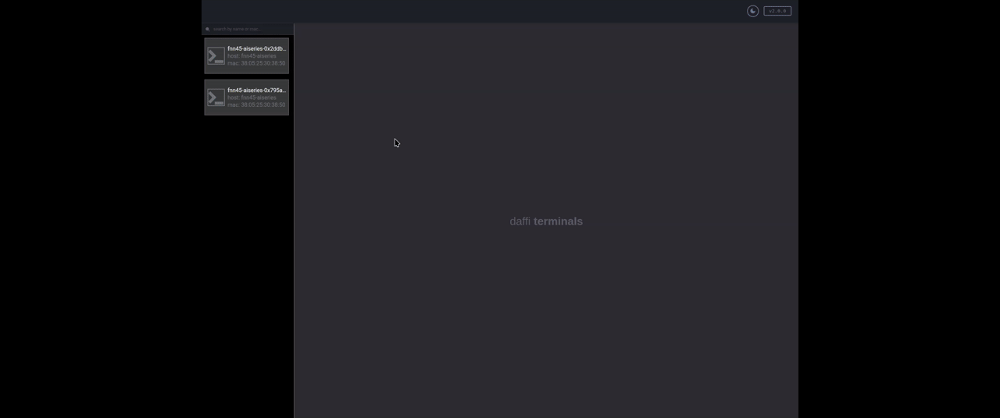
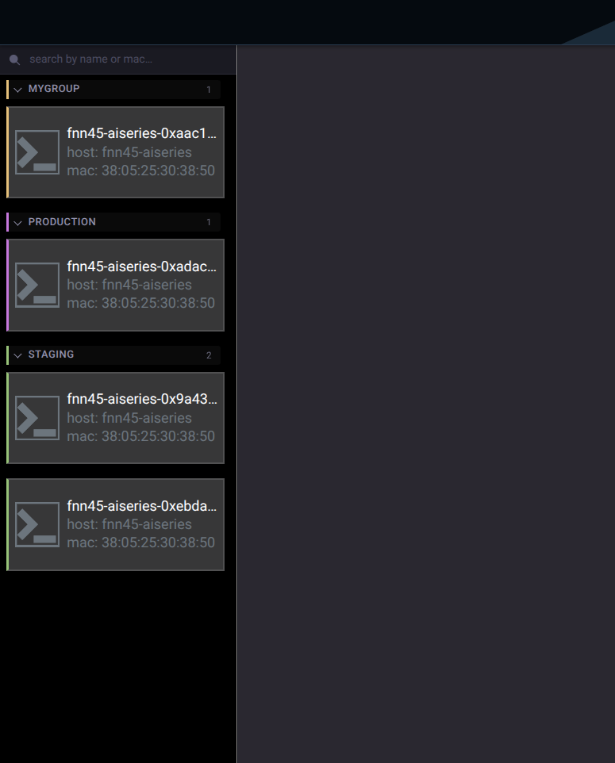

# daffi-terminals



A lightweight, browser-based remote terminal manager.
Connect any number of Linux/macOS hosts to a central router and open
interactive shell sessions in your browser — no SSH, no VPN, no agent
configuration required.

---

## Features

| | |
|---|---|
| **Multi-host** | Connect unlimited remote nodes; each appears as a card in the sidebar |
| **Live terminal** | Full interactive shell with automatic resize as you resize the browser window |
| **Autoreconnect** | Workers reconnect to the router automatically after any network interruption |
| **Host info** | Hostname, OS, kernel, CPU, memory and uptime shown in the header when you open a session |
| **Dark / Light theme** | Theme switcher with Solarized-inspired palettes, persisted across reloads |
| **Fuzzy search** | Filter the worker sidebar by name or MAC address |
| **TLS encryption** | Optional encryption for both the browser connection and the worker transport |
| **Zero footprint on workers** | Workers need only Python and `daffi` — no SSH daemon, no open ports |

---

## Installation

```bash
pip install daffi-terminals
```

Python 3.8+ is required.

---

## Quick start

**Terminal 1 — start the router** (the machine your browser will connect to):

```bash
dterm start-router \
  --rpc-host 0.0.0.0 \
  --rpc-port 9999 \
  --web-host 0.0.0.0 \
  --web-port 8888
```

Open `http://<router-host>:8888` in your browser.

**Terminal 2, 3, … — connect workers** (one per host you want to control):

```bash
dterm start-worker \
  --rpc-host <router-host> \
  --rpc-port 9999
```

Each worker appears in the sidebar within seconds. Click a card to open a
shell session.

---

## How it works

```
  Browser
     │  HTTP/WebSocket
     ▼
  Router  ──── RPC (TCP) ────►  Worker A  (any Linux/macOS host)
     │    ──── RPC (TCP) ────►  Worker B
     │    ──── RPC (TCP) ────►  Worker N  (as many as you need)
     │
  Web UI served on --web-port
  Workers registered on --rpc-port
```

The router is a single process that acts as both the RPC message broker
(for worker communication) and the web server (for the browser UI).
Workers connect outbound to the router — you never need to open ports on
the worker hosts.

---

## CLI reference

### `dterm start-router`

| Argument | Required | Description |
|----------|----------|-------------|
| `--rpc-host` | **yes** | Address the router listens on for worker connections (use `0.0.0.0` to accept from any host) |
| `--rpc-port` | **yes** | Port for worker connections |
| `--web-host` | **yes** | Address the web server listens on (use `0.0.0.0` to accept from any host) |
| `--web-port` | **yes** | Port for the browser UI |
| `--ssl-cert` | no | TLS certificate for worker connections (PEM). Enables encrypted RPC when combined with `--ssl-key` |
| `--ssl-key` | no | TLS private key for worker connections (PEM) |
| `--web-ssl-cert` | no | TLS certificate for the web server. Enables HTTPS/WSS when combined with `--web-ssl-key` |
| `--web-ssl-key` | no | TLS private key for the web server |

### `dterm start-worker`

| Argument | Required | Description |
|----------|----------|-------------|
| `--rpc-host` | **yes** | Hostname or IP of the router |
| `--rpc-port` | **yes** | Port of the router |
| `--name` | no | Name shown in the UI sidebar. Auto-generated as `<hostname>-0x<hex>` if omitted |
| `--group` | no | Visual group label. Workers with the same group appear together in a collapsible colored section (up to 7 groups) |
| `--ssl-cert` | no | TLS certificate (must match the router's certificate) |
| `--ssl-key` | no | TLS private key |

---

## Examples

### Worker groups



Workers can be organized into named groups using the `--group` flag.
Each group gets a distinct color and appears as a collapsible section in the sidebar,
sorted alphabetically. Workers without a group are listed at the top.

```bash
dterm start-worker --rpc-host router --rpc-port 9999 --group "production"
dterm start-worker --rpc-host router --rpc-port 9999 --group "production"
dterm start-worker --rpc-host router --rpc-port 9999 --group "staging"
dterm start-worker --rpc-host router --rpc-port 9999 --group "staging"
dterm start-worker --rpc-host router --rpc-port 9999   # ungrouped — shown at top
```

Up to 7 groups are supported, each with a unique color from the built-in rainbow palette.
Click a group header to collapse or expand it. The collapsed state is remembered across page reloads.

### Multiple workers on the same host

Give each worker a distinct name:

```bash
dterm start-worker --rpc-host router --rpc-port 9999 --name "web-server-1"
dterm start-worker --rpc-host router --rpc-port 9999 --name "web-server-2"
```

Or omit `--name` and let each instance generate its own unique identifier.

### Workers on remote hosts

The router address must be reachable from the worker host.
Replace `192.168.1.10` with your router's IP or hostname:

```bash
# on the router host
dterm start-router --rpc-host 0.0.0.0 --rpc-port 9999 \
                   --web-host 0.0.0.0 --web-port 8888

# on each remote worker host
dterm start-worker --rpc-host 192.168.1.10 --rpc-port 9999
```

### HTTPS + encrypted worker transport (TLS)

There are two ways to serve the web UI over HTTPS:

#### Option A — built-in TLS (simple, no extra software)

Pass certificate files directly to the router.
See [`examples/ssl/`](examples/ssl/) for ready-to-run scripts:

```bash
# 1. generate a certificate (uses mkcert if available, otherwise openssl)
bash examples/ssl/gen-certs.sh

# 2. start router — HTTPS on the web UI, TLS on the worker port
bash examples/ssl/start-router.sh

# 3. connect workers with TLS
bash examples/ssl/start-worker.sh
```

Open `https://localhost:8888`. If you used the openssl fallback (no mkcert),
click **Advanced → Accept the Risk and Continue** once.

#### Option B — nginx reverse proxy (recommended for production)

Run the web server on plain HTTP and let nginx handle TLS termination.
This is the standard production setup and works with any certificate,
including Let's Encrypt.

```
Browser ──HTTPS──► nginx :443 ──HTTP──► dterm web server :8888
```

Minimal nginx site config:

```nginx
server {
    listen 443 ssl;
    server_name terminals.example.com;

    ssl_certificate     /etc/letsencrypt/live/terminals.example.com/fullchain.pem;
    ssl_certificate_key /etc/letsencrypt/live/terminals.example.com/privkey.pem;

    location / {
        proxy_pass http://127.0.0.1:8888;

        # Required for WebSocket upgrade (used by /director and /terminal)
        proxy_http_version 1.1;
        proxy_set_header Upgrade    $http_upgrade;
        proxy_set_header Connection "upgrade";

        proxy_set_header Host              $host;
        proxy_set_header X-Real-IP         $remote_addr;
        proxy_set_header X-Forwarded-For   $proxy_add_x_forwarded_for;
        proxy_set_header X-Forwarded-Proto $scheme;

        # Keep terminal sessions alive during long idle periods
        proxy_read_timeout 3600s;
        proxy_send_timeout 3600s;
    }
}

# Redirect plain HTTP to HTTPS
server {
    listen 80;
    server_name terminals.example.com;
    return 301 https://$host$request_uri;
}
```

Start the router without any `--web-ssl-*` flags (nginx owns the cert):

```bash
dterm start-router \
  --rpc-host 0.0.0.0 --rpc-port 9999 \
  --web-host 127.0.0.1 --web-port 8888
```

The worker RPC transport is separate from the web server and can be
encrypted independently with `--ssl-cert` / `--ssl-key` regardless of
which HTTPS option you choose.

### Running as a systemd service

Worker on a remote host that should start automatically on boot:

```ini
# /etc/systemd/system/dterm-worker.service
[Unit]
Description=daffi-terminals worker
After=network-online.target
Wants=network-online.target

[Service]
ExecStart=/usr/local/bin/dterm start-worker \
    --rpc-host router.example.com \
    --rpc-port 9999
Restart=on-failure
RestartSec=5

[Install]
WantedBy=multi-user.target
```

```bash
sudo systemctl enable --now dterm-worker
```

---

## Makefile (development)

```bash
make start-router   # localhost:9999 (RPC) + localhost:8888 (web)
make start-worker   # connects to localhost:9999
```

Targets auto-detect the Python virtual environment in `.venv/` inside the project root.

---

## License

MIT — see [LICENSE.txt](LICENSE.txt).
